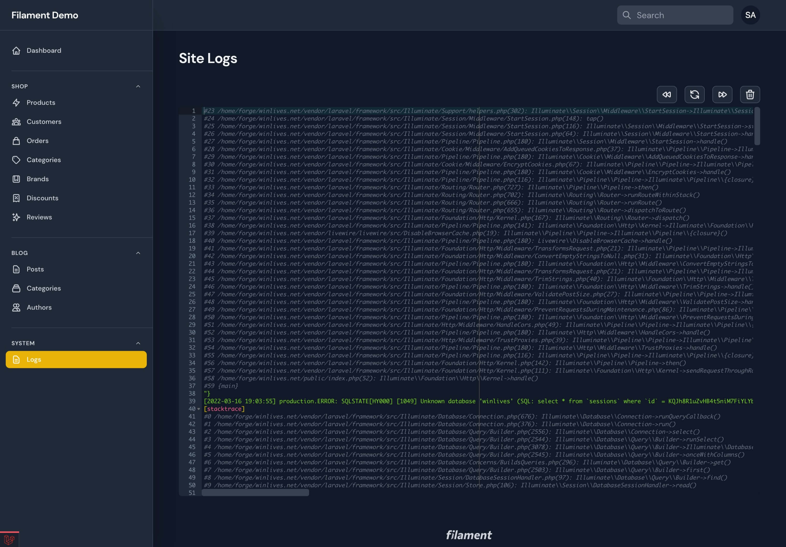

# Access laravel log through Filament admin panel



[](https://packagist.org/packages/saade/filament-laravel-log)
[](https://github.com/saade/filament-laravel-log/actions?query=workflow%3Arun-tests+branch%3Amain)
[](https://github.com/saade/filament-laravel-log/actions?query=workflow%3A"Check+%26+fix+styling"+branch%3Amain)
[](https://packagist.org/packages/saade/filament-laravel-log)

# Features

- Syntax highlighting
- Quickly jump between start and end of the file
- Refresh log contents
- Clear log contents
- Search multiple files in multiple directories <sup>New in v1.1.0</sup>
- Ignore file patterns <sup>New in v1.1.0</sup>

<br>

## Support Filament

<a href="https://github.com/sponsors/danharrin">

</a>

<br>

## Installation

You can install the package via composer:

```bash
composer require saade/filament-laravel-log
```

## Usage

Just install the package and you're ready to go!

## Configuration

You can publish the config file with:

```bash
php artisan vendor:publish --tag="log-config"
```

This is the contents of the published config file:

```php
<?php

return [
    /**
     * Secure the page behind a custom policy.
     */
    'authorization' => false,

    /**
     * The directory(ies) containing the log files.
     */
    'logsDir' => [
        storage_path('logs'),
    ],

    /**
     * Files to ignore when searching for log files.
     * Accepts wildcards eg: *.log
     */
    'exclude' => [
        //
    ],

    /**
     * Navigation group.
     */
    'navigationGroup' => 'System',

    /**
     * Navigation sort.
     */
    'navigationSort' => 1,

    /**
     * Navigation icon.
     */
    'navigationIcon' => 'heroicon-o-document-text',

    /**
     * Navigation label.
     */
    'navigationLabel' => 'Logs',

    /**
     * Navigation slug.
     */
    'slug' => 'system-logs',

    /**
     * Maximum amount of lines that editor will render.
     */
    'maxLines' => 50,

    /**
     * Minimum amount of lines that editor will render.
     */
    'minLines' => 10,

    /**
     * Editor font size.
     */
    'fontSize' => 12
];
```

## Authorization
If you would like to prevent certain users from accessing your page, you should enable `authorization` in config
```php
// config/filament-laravel-log.php

<?php
return [
    /**
     * Secure the page behind a custom policy.
     */
    'authorization' => true,
];
```
and register an authorization callback inside of a `ServiceProvider::boot()` method.


```php
// app/Providers/AppServiceProvider.php

<?php

public function boot()
{
    ViewLog::can(function (User $user) {
        return $user->role === Role::Admin;
    });
}
```

## Testing

```bash
composer test
```

## Changelog

Please see [CHANGELOG](CHANGELOG.md) for more information on what has changed recently.

## Contributing

Please see [CONTRIBUTING](.github/CONTRIBUTING.md) for details.

## Security Vulnerabilities

Please review [our security policy](../../security/policy) on how to report security vulnerabilities.

## Credits

- [Saade](https://github.com/saade)
- [Laravel Forge](https://forge.laravel.com) - for the syntax highlighting theme
- [ryangjchandler's Filament Log](https://github.com/ryangjchandler/filament-log) - based of for the authorization and multiple log files feature
- [All Contributors](../../contributors)

## License

The MIT License (MIT). Please see [License File](LICENSE.md) for more information.
